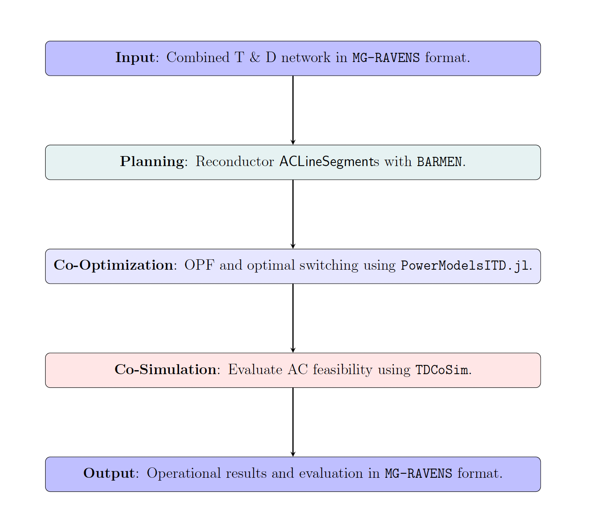

# Integrated Transmission-Distribution Pipeline

MG-RAVENS is a JSON-based dictionary representation of power system network data. It is closely based on the Common Information Model (CIM). While originally designed for distribution networks with microgrids, its capabilities have been enhanced to support integrated transmission and distribution networks, with `ConnectivityNode` and `Equipment` objects associated with the distribution network grouped into `Feeder` containers.

> **For more information about MG-RAVENS**: Please refer to the [ MG-RAVENS schema documentation](https://lanl-ansi.github.io/MG-RAVENS/) for a detailed breakdown of the format and what is currently supported.

In the COSTAD-MG project, MG-RAVENS is used as an API to coordinate **planning**, **co-optimization**, and **co-simulation** on a single integrated T\&D network. While co-optimization makes use of the entire network specification, the planning and co-simulation steps require only a subset of the available attributes, which can be easily accessed. The relevant attributes are as follows:

**Planning**:

* `ACLineSegment`: `r`, `x`, `bch`
* `OperationalLimitSet`: `ActivePowerLimit.value`; `CurrentLimit.value`

**Co-Simulation**:

* `EnergyConsumer`: `p`, `q`
* `AvPowerFlow`: `p`, `q` (from results)
* `OperationalLimitSet`: `ActivePowerLimit.value`, `CurrentLimit.value`

The RAVENS-enabled coordinated workflow is summarized in the following figure:

